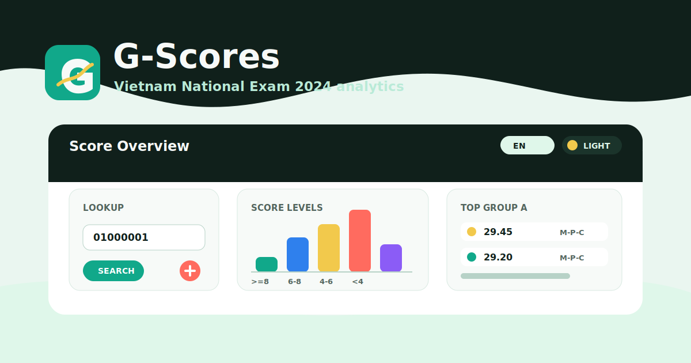

# Golden Owl Webdev Intern Assignment 3

<p align="center">
  
</p>

Full-stack G-Scores implementation for Vietnam National Exam 2024 data.

## Design Preview

The README thumbnail and app icon preview live at `docs/assets/g-scores-thumbnail.svg`. Import this SVG into Figma when you need an editable handoff thumbnail.

## Features

- CSV startup import into a database from `golden-owl-backend/sql/seeder/diem_thi_thpt_2024.csv`
- Score lookup by registration number
- Score level report per subject: `>= 8`, `6 - 8`, `4 - 6`, `< 4`
- Top 10 students for Group A: Math, Physics, Chemistry
- PrimeReact dashboard with chart, table, score cards, language switcher, and light/dark theme switcher

## Backend

Default local mode uses H2 file database so the app can run without Docker. First startup imports the CSV once, then skips import when data already exists.

```bash
cd golden-owl-backend
./mvnw spring-boot:run
```

API docs:

- Human guide: `docs/API.md`
- OpenAPI JSON: `http://localhost:8080/v3/api-docs`
- OpenAPI YAML: `http://localhost:8080/v3/api-docs.yaml`

PostgreSQL mode:

```bash
cd golden-owl-backend
docker compose up --build
```

## Frontend

```bash
cd golden-owl-frontend
npm install
npm run dev
```

Set `VITE_API_BASE_URL` if backend is not at `http://localhost:8080/api`.

## Verification

```bash
cd golden-owl-backend
./mvnw test

cd ../golden-owl-frontend
npm run build
```

## CI/CD

GitHub Actions are configured for:

- CI: backend tests, frontend lint, frontend build
- Sonar scan: needs `SONAR_TOKEN` secret and `SONAR_PROJECT_KEY` repository variable. Set `SONAR_ORGANIZATION` for SonarQube Cloud and optionally `SONAR_HOST_URL` for SonarQube Server.
- Package publish: publishes the backend Docker image to GitHub Container Registry on release or manual dispatch.
- Vercel deploy: needs `VERCEL_TOKEN`, `VERCEL_ORG_ID`, and `VERCEL_PROJECT_ID` secrets. Production deploys run on `main` or `master`; pull requests use preview deployments.
